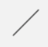

[Zurück](Nikolaus.md)

---

# Zeichnen geometrischer Formen

Wir haben schon einige Möglichkeiten kennengelernt, Formen zu zeichnen.
Es gibt zum Beispiel die folgenden Formen.

* `rectangle ( 30, 20 )`  
  führt zu:  
  

* `square 20`  
  führt zu:  
  

* `circle 10`  
  führt zu:  
  

* `oval ( 30, 20 )`  
  führt zu:  
  

* `segment ( 0, 0 ) ( 30, 30 )`  
  führt zu:  
  

* `text "Hallo"`  
  führt zu:  
  

Die Formen werden (außer beim `segment`) immer um den Koordinatenursprung `( 0, 0 )` zentriert. Um eine Form wir das Rechteck an einer anderen Stelle zu zeichnen, können Formen verschoben werden. Ein Teilbild kann mit Hilfe von `image |> move ( x, y )` an eine beliebige Position verschoben werden. Dabei ist `image` das Bild, das verschoben wird, und `(x,y)` die Angabe, um wie viele Pixel das Bild in `x`- bzw. `y`-Richtung verschoben wird.

---

[Weiter](Re-Use.md)
